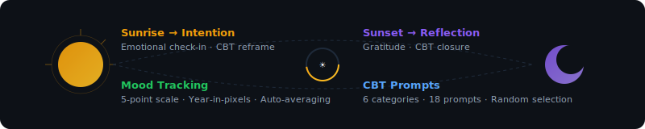
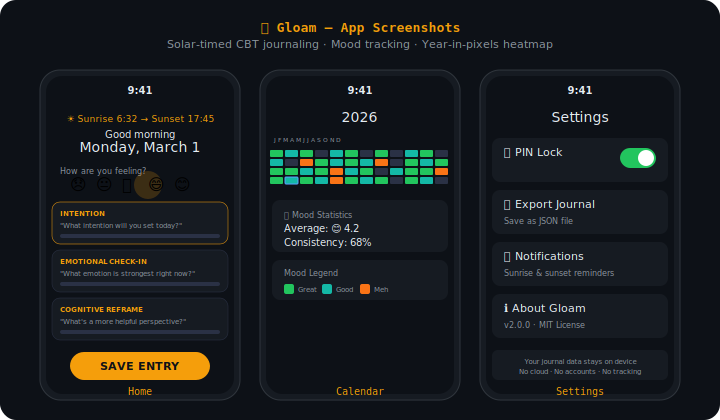

<div align="center">

# 🌗 G L O A M
### *Solar-Timed Journaling for Android & Desktop.*

[]()
[]()
[](LICENSE)

**[📲 Download APK](https://github.com/earnerbaymalay/Gloam/releases)** · **[🌐 Sideload Hub](https://earnerbaymalay.github.io/sideload/)** · **[📖 Usage Guide](docs/USAGE.md)** · **[🔧 Troubleshooting](TROUBLESHOOTING.md)**

</div>

---



---



## What is Gloam?

**Gloam uses a NOAA solar calculator to determine precise sunrise and sunset times for your location. The interface transitions through morning, daytime, sunset, and nighttime themes. Each transition introduces contextually timed CBT prompts selected from a pool of 18 prompts across 6 categories.**

You select your mood on a 5-point scale. Gloam tracks daily averages and displays a year-in-pixels heatmap. All data is encrypted with SQLCipher and secured with a PIN.

---

## Quick Start

### Install on Android

1. Download the latest APK from [GitHub Releases](https://github.com/earnerbaymalay/Gloam/releases)
2. Enable "Install unknown apps" in Android settings
3. Install and open — no account, no setup, no cloud

### Install via Sideload Hub (Any Device)

📲 **[Open Sideload Hub](https://earnerbaymalay.github.io/sideload/)** — your central distribution point for all apps. Open in any browser, tap "Add to Home Screen," and you're done.

### Build from Source

```bash
git clone https://github.com/earnerbaymalay/Gloam.git
cd Gloam
```

Open in Android Studio → Sync Gradle → Run (Minimum SDK 26, Target SDK 34, JDK 17 required).

---

## Features

| Feature | Description |
|---------|-------------|
| **Four screens** | Home (journal + mood + CBT), Calendar (heatmap + stats), Entries (chronological list), Settings (PIN + export). |
| **CBT prompts** | 18 prompts across 6 categories. Each session provides 3 random prompts to prevent repetition. |
| **Mood tracking** | 5-point scale with emoji, daily averages, year-in-pixels heatmap, and consistency percentage. |
| **Solar themes** | NOAA calculator for your location automatically shifts themes throughout the day. |
| **Security** | SQLCipher-encrypted database, SHA-256 PIN lock, no cloud dependency. |

---

## Screens & Workflow

```
Home Screen                    Calendar Screen
┌─────────────────┐            ┌─────────────────┐
│ 🌅 Sunrise 6:42 │            │  Year in Pixels  │
│ 😞 😐 🙂 😄 😊 │            │  █▓▒░█▓▒░█▓▒░  │
│                 │            │  Avg: 3.4        │
│ "What intention │            │                 │
│  will you set?" │            │  📊 Mood Stats   │
│                 │            │  😊 40% 😐 30%   │
│ [Save]          │            │  😞 30%          │
└─────────────────┘            └─────────────────┘

Entries Screen                 Settings Screen
┌─────────────────┐            ┌─────────────────┐
│ 📝 Today 8:15am │            │ 🔒 PIN Lock: OFF │
│ Mood: 😊 Great  │            │                 │
│                 │            │ 📤 Export JSON   │
│ 🌙 Yesterday    │            │                 │
│ Mood: 😐 Okay   │            │ 🔔 Notifications │
│                 │            │                 │
└─────────────────┘            └─────────────────┘
```

### Sunrise vs Sunset Entries

Gloam automatically adjusts prompts based on solar position:

- **Before solar noon:** Sunrise entries — intention, emotional check-ins, cognitive reframing.
- **After solar noon:** Sunset entries — reflection, gratitude, closure.

You can create both a sunrise and sunset entry each day.

---

## Build and Run

### Android

```bash
git clone https://github.com/earnerbaymalay/Gloam.git
cd Gloam
```

Open in Android Studio, sync Gradle, then run. Minimum SDK is 26, target SDK is 34.

### Desktop (Compose Multiplatform)

```bash
./gradlew composeApp:assemble         # Builds for current OS
./gradlew composeApp:packageDmg       # Packages for macOS
./gradlew composeApp:packageMsi       # Packages for Windows
./gradlew composeApp:packageDeb       # Packages for Linux
```

---

## Related Projects

<div align="center">

| Project | Platform | Description | Link |
|---------|----------|-------------|------|
| 🌌 **Aether** | 📱 Android (Termux) | Local-first AI workstation | [Source →](https://github.com/earnerbaymalay/aether) |
| 🛡️ **Cyph3rChat** | 📱 Android | E2E encrypted messaging | [Source →](https://github.com/earnerbaymalay/cyph3rchat) |
| 📲 **Sideload Hub** | 🌐 Web / PWA | Central app distribution | [Open Hub →](https://earnerbaymalay.github.io/sideload/) |
| 🧰 **Termux-Vault** | 📱 Android | Encrypted secrets manager | [Source →](https://github.com/earnerbaymalay/Termux-Vault) |

</div>

---

## Documentation

- **[📖 Usage Guide](docs/USAGE.md)** — First launch, journaling, mood tracking, PIN lock, export, notifications.
- **[🔧 Troubleshooting](TROUBLESHOOTING.md)** — Common issues, location/PIN/export fixes, notification support.
- **[🗺️ Roadmap](docs/ROADMAP.md)** — Planned features: PWA, E2EE sync.
- **[📐 Architecture](docs/ARCHITECTURE.md)** — Technical breakdown, module structure.
- **[🔒 Security](SECURITY.md)** — Security model, threat model, encryption details.
- **[🤝 Contributing](CONTRIBUTING.md)** — How to contribute, code of conduct.

---

## Privacy

- **Offline operation:** Gloam functions entirely offline; no internet connection is required.
- **No accounts:** No registration or passwords needed.
- **No cloud storage:** Your journal data remains exclusively on your device, unless you choose to export it.
- **No analytics:** No tracking, crash reporting, or telemetry data is collected.
- **Encrypted data:** SQLCipher protects your database at rest.
- **Backup exclusion:** Gloam data is excluded from Android backup, cloud backup, and device transfer processes.

---

[MIT License](LICENSE)
